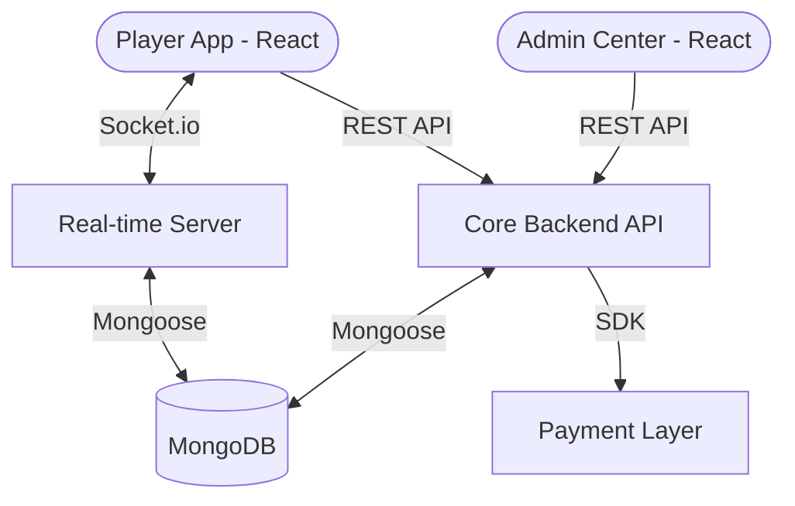

# 🎲 LudoWins - Professional Real-Money Gaming Platform

LudoWins is a high-performance, real-money Ludo gaming platform tailored for the Indian market. Built on a modern decoupled architecture, it offers a seamless multiplayer experience, robust administration, and secure financial operations.

[](https://opensource.org/licenses/ISC)
[](https://reactjs.org/)
[](https://nodejs.org/)

---

## 🏗️ System Architecture

Our platform utilizes a micro-service inspired architecture to ensure low latency and high scalability.



---

## 📖 Detailed Documentation

Explore our comprehensive guides for setup, development, and operational management:

| Resource | Description |
| :--- | :--- |
| [📂 **Architecture Deep Dive**](docs/ARCHITECTURE.md) | Detailed system design and component interaction. |
| [📂 **API Reference**](docs/API.md) | Endpoint definitions for Auth, Challenges, and and Transactions. |
| [📂 **Deployment Guide**](docs/DEPLOYMENT.md) | Step-by-step instructions for Local and Production setup. |

---

## 📂 Project Organization

The platform is divided into four primary modules:

- [**`lodo-frontend-main`**](lodo-frontend-main/lodo-frontend-main) - Mobile-optimized Player App.
- [**`admin-bkp-main`**](admin-bkp-main/admin-bkp-main) - Professional Admin Control Center.
- [**`backend-api-main`**](backend-api-main/backend-api-main) - REST API Service Layer.
- [**`playsocket-bkp-main`**](playsocket-bkp-main/playsocket-bkp-main) - Real-time Synchronization Engine.

---

## 🚀 Quick Start (Development)

1. **Clone & Setup**:
   ```bash
   git clone https://github.com/nkdhawan76/Ludo-By-Nikhil-Dhawan.git
   cd Ludo-By-Nikhil-Dhawan
   ```

2. **Initialize Components**:
   Follow the [**Deployment Guide**](docs/DEPLOYMENT.md) to start your local MongoDB and initialize each service folder using `npm install`.

3. **Environments**:
   Update your API base URLs in `config.js` and connection strings in `default.json` for each component.

---

## 🛡️ Security & Performance
- **Data Protection**: All sensitive user data is encrypted and transactions are protected via secure gateway integrations.
- **Optimization**: Images are automatically optimized into `.webp` format using the `Sharp` library for fast mobile loading.
- **Concurrency**: The Socket server is optimized to handle thousands of concurrent game events with minimal jitter.

---
*Developed with ❤️ for the Indian Gaming Ecosystem.*
