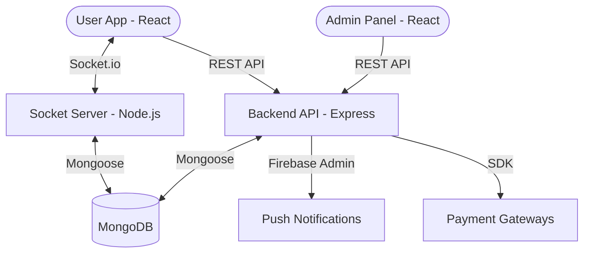

# 🏗️ System Architecture

LudoWins is built using a modern decoupled architecture that separates user interaction, administrative management, core business logic, and real-time synchronization.

## 📡 Overview Diagram

## 🏢 Core Components

### 1. **Client Frontend (`lodo-frontend-main`)**
- **Purpose**: Mobile-first user experience for players.
- **Features**: Matchmaking, game board rendering, wallet management, real-time moves.
- **Tech**: React 18, Redux (State), Socket.io-client (Real-time).

### 2. **Admin Dashboard (`admin-bkp-main`)**
- **Purpose**: Central command center for platform owners.
- **Features**: User KYC approval, withdrawal processing, game monitoring, financial reports.
- **Tech**: React 16.9 (Standardized), Bootstrap 4, Premium Dashboard Components.

### 3. **Backend API (`backend-api-main`)**
- **Purpose**: Business logic layer and data orchestrator.
- **Features**: Authentication, Transaction logic, KYC management, Game history persistence.
- **Tech**: Node.js, Express, MongoDB/Mongoose.

### 4. **Socket Server (`playsocket-bkp-main`)**
- **Purpose**: Low-latency gameplay synchronization.
- **Features**: Real-time position updates, timer management, turn-based synchronization.
- **Tech**: Node.js, Socket.io, Mongoose.

## 💾 Data Persistence
- **MongoDB**: Primary database for users, transactions, and game logs.
- **Firebase**: Used for push notifications and potentially secondary data storage.
